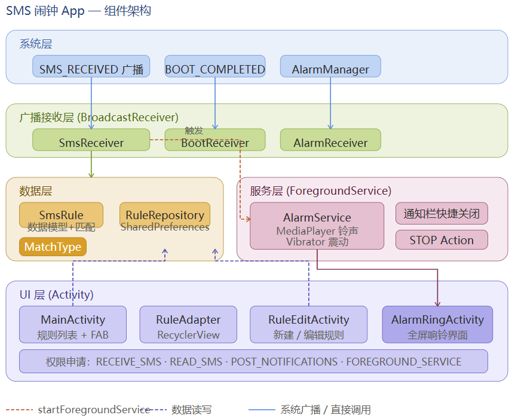
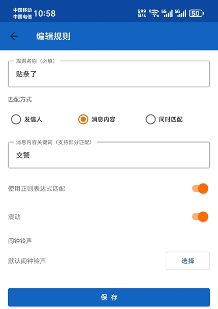
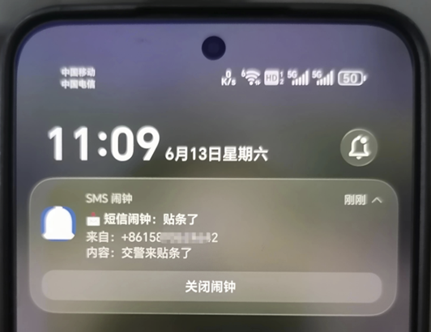

# SMS 秒响闹钟 App

基于Android Studio开发的短信监听触发闹钟提醒的应用，解决短信漏看或未及时看造成损失的问题。
- 场景1 交警12123发送的停车违章短信（如：笔者在开腾讯会议没注意到短信，被罚200大洋，上班都没心情了）
- 场景2 银行发送的信用卡还款短信
- 场景3 银行转账提醒短信
- ......
- 场景n 任何重要的短信，需要手机闹钟提醒的场景

## 功能特性

- 📩 **监听系统短信**：后台实时接收并解析短信（含多段短信合并）
- 🎯 **灵活匹配规则**：
  - 按**发信人**匹配（手机号或部分名称）
  - 按**消息内容**匹配（关键词）
  - **同时匹配**发信人 + 内容（AND 逻辑）
  - 支持**正则表达式**高级匹配
- 🔔 **触发闹钟**：
  - 全屏响铃界面（锁屏上方显示）
  - 可自定义铃声
  - 可开关震动
  - 通知栏快速关闭
- ⚙️ **规则管理 UI**：
  - 添加、编辑、删除规则
  - 每条规则单独启用/禁用开关
  - 规则列表实时展示匹配条件
- 🚀 **开机自启**：设备重启后自动恢复监听

## 环境要求

| 项目 | 版本                     |
|------|------------------------|
| Android Studio | Giraffe / Hedgehog 及以上 |
| compileSdk | 34                     |
| minSdk | 26 (Android 8.0)       |
| Gradle | 8.5                    |
| AGP | 8.2.0                  |

## 项目结构

```
SmsAlarmApp/
├── app/src/main/
│   ├── AndroidManifest.xml          # 权限声明、组件注册
│   ├── java/com/smsalarm/app/
│   │   ├── data/
│   │   │   ├── MatchType.java       # 匹配类型枚举（SENDER/CONTENT/BOTH）
│   │   │   ├── SmsRule.java         # 规则数据模型 + 匹配逻辑
│   │   │   └── RuleRepository.java  # 规则持久化（SharedPreferences）
│   │   ├── receiver/
│   │   │   ├── SmsReceiver.java     # 短信广播接收器（核心）
│   │   │   ├── BootReceiver.java    # 开机广播接收器
│   │   │   └── AlarmReceiver.java   # 闹钟定时触发接收器
│   │   ├── service/
│   │   │   └── AlarmService.java    # 前台服务：播放铃声 + 震动
│   │   └── ui/
│   │       ├── MainActivity.java    # 主界面：规则列表
│   │       ├── RuleAdapter.java     # RecyclerView 适配器
│   │       ├── RuleEditActivity.java # 规则编辑界面
│   │       └── AlarmRingActivity.java # 响铃全屏界面
│   └── res/
│       ├── layout/                  # 4 个布局文件
│       ├── values/                  # 颜色、字符串、主题
│       ├── drawable/                # ic_alarm.xml, ic_stop.xml
│       └── menu/                    # menu_main.xml
└── build.gradle
```

## 导入与运行

1. 打开 Android Studio → **File → Open**，选择 `SmsAlarmApp` 文件夹
2. 等待 Gradle Sync 完成（首次需下载依赖，约 2-5 分钟）
3. 连接 Android 设备（或启动模拟器，Android 8.0+）
4. 点击 **Run ▶** 安装运行
5. 首次启动时授予 **接收短信** 和 **通知** 权限

## 使用说明

### 创建规则
1. 点击主界面右下角 **+** 按钮
2. 输入规则名称（如"银行验证码"）
3. 选择匹配方式：发信人 / 消息内容 / 同时匹配
4. 输入关键词（如发信人填 `95533`，内容填 `验证码`）
5. 选择铃声和是否震动
6. 点击**保存**

### 规则示例

| 场景 | 匹配方式 | 发信人关键词 | 内容关键词 |
|------|---------|------------|----------|
| 银行转账提醒 | 发信人 | 95533 | - |
| 包含"重要"的任意短信 | 消息内容 | - | 重要 |
| 某人发来含特定词 | 同时匹配 | 13812345678 | 到了 |

## 注意事项

- **部分国产 ROM**（小米/华为/OPPO 等）需要在系统设置中额外开启"自启动"和"后台运行"权限
- Android 12+ 需要在系统设置 → 应用 → 特殊权限中开启"精确闹钟"权限（或使用非精确模式）
- 短信监听是**静态广播**，App 无需保持前台运行即可接收短信

## 实测效果展示
- 新建规则
- 
- 收到短信效果
- 